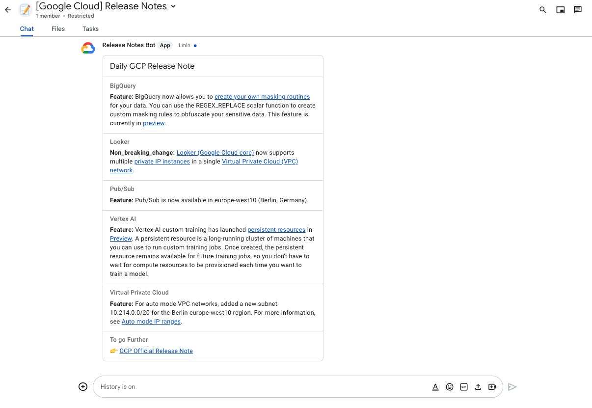
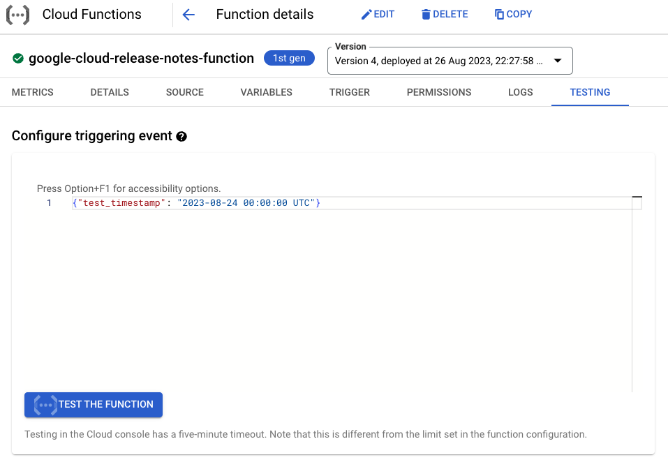

# Scheduled GCP Release Notes

🌟 Stay Informed: Imagine receiving customized notifications about updates to GCP products that truly matter to you. No more information overload – just what's relevant!

💡 Your Preferences, Your Way: You're in control. Choose the GCP products you care about and set intervals that fit your schedule. Stay informed about the latest features, essential fixes, and key developments.

⏱️ Simple Deployment: Whether you're new to GCP or a seasoned pro, my quick deployment script ensures an easy setup. It's a user-friendly tool suitable for anyone stepping into the world of Google Cloud Platform.



## How does this work?

This application operates in a straightforward manner:
- It sets up a Cloud Scheduler with your preferred schedule.
- Whenever the Cloud Scheduler is activated, a Cloud Function updates your BigQuery table for release notes.
- Subsequently, the fresh release notes are retrieved through queries and dispatched to your designated Google Space.


## Requirements

### Create and configure your WebHook

To ensure its functionality, you'll first need an existing Google Space. 
If you wish to create a new Google Space, follow these steps:
- Go to `Google Chat`: https://mail.google.com/chat/
- Click on the `➕` button located next to `Space`, then select `Create a Space`.
- Provide a name (e.g., `[Google Cloud] Release Notes`) and configure any optional settings you prefer.

Once you've completed these steps:
- Enter the Google Space and click on the `ᐯ` symbol next to the Space's name.
- Choose `Manage Webhooks`.
- Specify a name for your WebHook (e.g., `Release Notes Bot`) and optionally add an avatar image using a URL.

> Finally, copy your WebHook URL.

### Clone the repository

To get started, clone the repository onto your local machine using either `HTTPS` or `SSH` mode:

Using `HTTPS`: 

```sh
git clone https://github.com/AxelThevenot/scheduled-gcp-release-notes.git
```

Using `SSH`:

```sh
git clone git@github.com:AxelThevenot/scheduled-gcp-release-notes.git
```

### Configure the application

To configure the application, follow these steps:

1. Open the src/yaml file for editing.
2. Update the following configurations:
- `webhook_url`: Replace the existing string with the WebHook URL you copied earlier.
- `release_note_types`: Comment out or remove the release note types that you are not interested in.
- `product_names`: Keep **only** the GCP products that you are interested in. Please note that there are many products available, and **selecting all of them will result in an extensive message.**

Ensure you save the changes after editing the file.


## Deploy the application on your project

No scripts are provided in order to make everything transparent for you.

You can just copy and paste the following script using `gcloud` CLI.

## Deploying the Application to Your Project

We've kept everything transparent by not providing scripts, so you can better understand the process. Follow these steps to deploy the application using the `gcloud` CLI:

### Deploying the Infrastructure

Unfortunately, we don't have a Terraform file available. But you can still proceed by using the following script. Just make sure to replace the placeholders with your specific information:

- Replace `"your-project-id"` with your actual project ID.
- Adjust the CRON expression (`'0 9 * * *'`) as needed. (Learn more about [Cron Expressions](https://cloud.google.com/scheduler/docs/configuring/cron-job-schedules))
- Set the TZ Identifier of your time zone (`"Europe/Paris"`). (Find the correct [TZ Identifier](https://en.wikipedia.org/wiki/List_of_tz_database_time_zones))

Run the script as shown below:

```sh
./deploy.sh "<your-project-id>" '0 9 * * *' "Europe/Paris"
```

And that's it! Your application will be up and running.

## Testing the Function

To test the function, follow these steps in the Google Cloud Console UI:




1. Go to [Google Cloud Function](https://console.cloud.google.com/functions/list).
2. Click on your newly deployed function named `google-cloud-release-notes-function`, then navigate to the `TESTING` tab.
3. Provide the following argument. (I've deliberately set a non-sense timestamp so that you can manually set a timestamp that isn't too distant. A span of 2 or 3 days should suffice.)

Argument:
```json
{
  "test_timestamp": "2023-13-31 00:00:00 UTC"
}
```

By following these steps, you can effectively test the function and ensure its proper operation.

## Additional resources

To repopulate the configuration you can check for yourself the existing product names on BigQuery.

```sql
WITH 
  distinct_procuct_name AS (
    SELECT DISTINCT
      product_name
    FROM `bigquery-public-data.google_cloud_release_notes.release_notes`
    ORDER BY
      product_name
  )
SELECT 
  STRING_AGG(product_name, '\n  - ') AS `product_names`,
FROM distinct_procuct_name
```

The same for the release note types.

```sql
WITH 
  distinct_release_note_type AS (
    SELECT DISTINCT
      release_note_type,
      COUNT(1) OVER(PARTITION BY release_note_type) AS `release_note_type__count`, 
    FROM `bigquery-public-data.google_cloud_release_notes.release_notes`
    ORDER BY
      release_note_type__count DESC
  )
SELECT 
  STRING_AGG(release_note_type, '\n  - ') AS `release_note_types`,
FROM distinct_release_note_type
```
